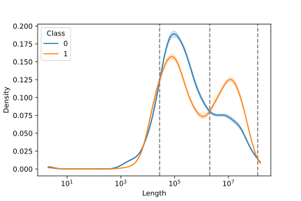

# DBFE: Distribution-Based Feature Extractor
 <-- [](http://badge.fury.io/py/dbfe) -->
[](https://github.com/MNMdiagnostics/distribution_based_features/actions/workflows/python-app.yml)


[](https://github.com/MNMdiagnostics/distribution_based_features/discussions)

DBFE is a Python library with feature extraction methods that facilitate classifier learning from distributions of genomic variants. 

## Installing dbfe

To install dbfe, just execute:

```bash
pip install dbfe
```

Afterwards you can import `dbfe` and use all the classes and functions. To run all the tests and experiments you will require additional packages, which can be installed using the `requirements.txt` file found in this repository:

```
pip install -r requirements.txt
```

## Quickstart

```python
import pandas as pd

from sklearn.metrics import roc_auc_score
from sklearn.model_selection import train_test_split
from sklearn.pipeline import make_pipeline
from sklearn.preprocessing import StandardScaler
from sklearn.linear_model import LogisticRegression

import dbfe

# sample data
stat_vals = pd.read_csv(f"../experiments/data/ovarian/ovarian_cnv.csv.gz", index_col='SAMPLEID')
stat_vals = stat_vals.loc[stat_vals.SVCLASS == "DEL", :]
stat_vals = stat_vals.groupby(stat_vals.index)['LEN'].apply(list).to_frame()

labels = pd.read_csv(f"../experiments/data/ovarian/labels.tsv", sep='\t', index_col=0)
labels = (labels == "RES") * 1
stat_df = stat_vals.join(labels.CLASS_LABEL, how='inner')

# splitting into training and testing data
X = stat_df.loc[:, "LEN"]
y = stat_df.loc[:, "CLASS_LABEL"]
X_train, X_test, y_train, y_test = train_test_split(X, y, test_size=0.25, random_state=23, stratify=y)

# DBFE in a classification pipeline
extractor = dbfe.DistributionBasedFeatureExtractor(breakpoint_type='supervised', n_bins='auto', cv=10)
pipe = make_pipeline(extractor, StandardScaler(), LogisticRegression())
pipe.fit(X_train, y_train)

extractor.plot_data_with_breaks(X_train, y_train, plot_type='kde')
y_prob = pipe.predict_proba(X_test)
print("AUC on test data: {:.3}".format(roc_auc_score(y_test, y_prob[:, 1])))
```



More code examples can be found in the `examples` folder.

## Reproducible experiments

The repository contains reproducible experiment source code in the form of a Jupyter notebook and detailed results of the analyses discussed in "DBFE: Distribution-based feature extraction from copy number and structural variants in whole-genome data" by Piernik *et al.* To re-run the experiments or analyze the results go to the `experiments` folder. The code there is organized as follows:

- the root of the folder contains the experiment source code; to start the analysis run the `experiments.ipynb` notebook (remember to install requirements.txt beforehand);
- the `data` folder contains variant length and gene amplification datasets; there you will also find the `get_variant_lengths.py` utility script for extracting variant lengths from Manta, Strelka, Brass, and Ascat VCF files;
- `results` plots and tabular results (in CSV format) corresponding to different parts of the analysis.

## License

- This project is released under a permissive new BSD open source license ([LICENSE-BSD3.txt](https://github.com/MNMdiagnostics/distribution_based_features/blob/master/LICENSE-BSD3.txt)) and commercially usable. There is no warranty; not even for merchantability or fitness for a particular purpose.
- In addition, you may use, copy, modify and redistribute all artistic creative works (figures and images) included in this distribution under the directory
according to the terms and conditions of the Creative Commons Attribution 4.0 International License.  See the file [LICENSE-CC-BY.txt](https://github.com/MNMdiagnostics/distribution_based_features/blob/master/LICENSE-CC-BY.txt) for details. (Computer-generated graphics such as the plots produced by seaborn/matplotlib fall under the BSD license mentioned above).

## Citing

If you use dbfe as part of your workflow in a scientific publication, please consider citing the associated paper:

```
@article{piernik_2022_dbfe,
  author       = {Maciej Piernik},
  title        = {DBFE: Distribution-based feature extraction from 
                  copy number and structural variants in whole-genome data},
  journal      = {To be published},
  year         = 2022
}
```

- Piernik, M. *et al.* (2022) DBFE: Distribution-based feature extraction from copy number and structural variants in whole-genome data. *To be published.*

## Contact

The best way to ask questions is via the [GitHub Discussions channel](https://github.com/MNMdiagnostics/distribution_based_features/discussions). In case you encounter usage bugs, please don't hesitate to use the [GitHub's issue tracker](https://github.com/MNMdiagnostics/distribution_based_features/issues) directly. 
